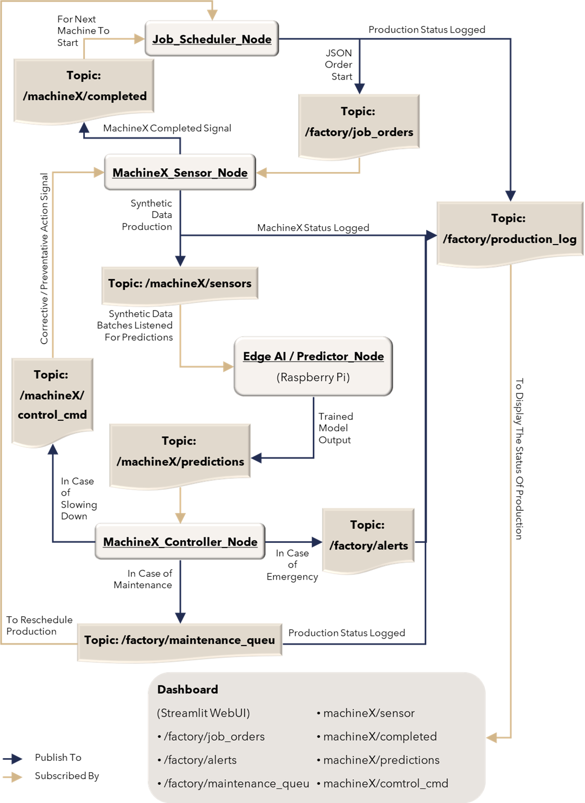

# Edge AI Remaining Useful Life (RUL) Prediction for Industrial Machines

## Project Overview
This project aims to build a ROS2-based Digital Twin for predictive maintenance in industrial environments. Using synthetic sensor data from six factory machines (three main, three auxiliary), the system predicts Remaining Useful Life (RUL) for each machine and dynamically manages production flow on Edge AI hardware (e.g., Raspberry Pi).

### Key Philosophy
- **Expert Models:** Six specialized models are trained, each tailored to the unique physics and failure modes of its respective machine.
- **Controller Node:** RUL predictions are used by a controller node to implement rule-based maintenance actions, with future plans to upgrade to a Reinforcement Learning (RL) agent for optimal maintenance and load balancing.
- **Target Metrics:** RUL prediction accuracy >80%, latency <50ms per node, and >25% reduction in downtime (RL vs rule-based).

## Machine List & Dataset Mapping
Only the following datasets are used in the current implementation:

| Type      | Machine Name     | ROS Topic        | Dependency      | Dataset Link                                                                 |
|-----------|------------------|------------------|-----------------|-----------------------------------------------------------------------------|
| Main 1    | Hydraulic Press  | /machine_press   | -               | https://archive.ics.uci.edu/ml/datasets/condition+monitoring+of+hydraulic+systems |
| Helper 1  | Process Pump     | /machine_pump    | Feeds Press     | https://www.kaggle.com/datasets/anseldsouza/water-pump-rul-predictive-maintenance |

Other machines and datasets are planned for future integration.

## Architecture

- **Predictor Node:** Listens to six ROS2 topics, dispatches incoming messages to the correct expert model, and performs inference in RAM for low latency. All models are loaded at startup.
- **Controller Node:** Receives RUL predictions and makes maintenance decisions. Initially rule-based, with RL agent integration planned for learning optimal strategies in simulated environments.

## Current Progress
- **Hydraulic Press Model:** Trained using the UCI Hydraulic Systems dataset. Full pipeline includes feature extraction, stratified train-test splitting, scaling, XGBoost regression, and drift diagnostics. Model and scaler are saved for deployment.
- **Process Pump Model:** Trained using the Water Pump RUL dataset as a proxy for hydraulic pump RUL prediction. Similar pipeline and diagnostics applied.
- **Diagnostics:** Feature importance, drift analysis, and performance metrics are generated and saved for both models.

## Next Steps
- Integrate additional machines and datasets as listed above.
- Develop and test the RL-based Controller Node for dynamic maintenance and load balancing.
- Deploy models on Edge AI hardware and validate latency and accuracy targets in real-world scenarios.

## Project Philosophy & Updates
This README will be updated as new models, datasets, and architectural improvements are added. The focus remains on modular, scalable, and high-accuracy predictive maintenance for industrial digital twins.
