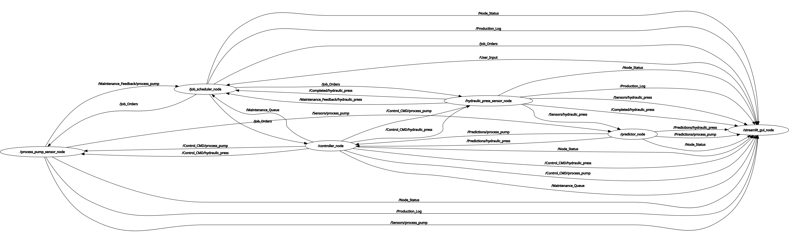

# Edge AI for Industrial Predictive Maintenance: ROS2 Digital Twin Framework

## Project Overview
This project delivers a modular ROS2-based Digital Twin framework designed for high-precision Predictive Maintenance (PdM) in industrial environments. By integrating a Multi-Stage Machine Learning pipeline on Edge hardware (Raspberry Pi), the system predicts the Remaining Useful Life (RUL) of critical components and triggers autonomous corrective actions to prevent catastrophic failures.

---

## System Architecture & Information Flow
The framework is built on a decoupled ROS2 architecture, ensuring horizontal scalability and real-time deterministic responsiveness.

- **Sensing (Digital Twin):** Physically consistent synthetic data generation (Vibration, Thermal, Pressure) with dynamic noise modeling and quadratic degradation.
- **Inference (Predictor Node):** Multi-stage ONNX-optimized pipeline performing feature engineering on a 60-cycle sliding window for real-time Edge inference.
- **Action (Controller Node):** State-machine logic implementing Hysteresis & State Escalation (Normal -> Slow Down -> Shutdown) to ensure system stability.

- **Maintenance (Maintenance Queue):** `Controller_Node` publishes maintenance schedules to a `Maintenance_Queue` topic when predictions indicate required intervention. `Job_Scheduler_Node` subscribes to this queue and reorders or pauses jobs to accommodate maintenance windows, while machines publish maintenance feedback (e.g., `Maintenance_Feedback/<machine>`) when maintenance is complete.


---

## Safety-First: Failure Mode & Effects Analysis (FMEA)
In industrial "Safety-Critical" environments, prediction reliability is paramount. This project incorporates a high-level FMEA-driven mitigation strategy to manage operational risks:

| Potential Failure | Effect | Mitigation Strategy |
|---|---|---|
| False Negative (Undetected Wear) | Unexpected hardware failure. | **Multi-stage Verification:** Conservative thresholds; critical degradation triggers an immediate **SHUTDOWN**. |
| False Positive (Early Warning) | Unnecessary production halt. | **Control Hysteresis:** State changes require persistent signals over multiple cycles to prevent oscillation. |
| Predictor Latency | Delayed reaction to failure. | **ONNX Optimization:** Inference is performed locally on the Edge to bypass network latency and ensure determinism. |

---

## Machine Learning Strategy & Implementation

### 1. Hierarchical Inference Pipeline
The `Predictor_Node` employs a sophisticated inference strategy to maximize accuracy near the End of Life (EoL):

- **Stage 1 (Classification):** Binary detection of the critical degradation phase.
- **Stage 2 (Specialized Regression):** Dynamic switching between "Base" and "Ultra-Critical" regression models as RUL approaches zero.
- **Reliability Fallback:** Automated fallback from ONNX Runtime to XGBoost ensures **100% system availability**.

### 2. Synthetic Data Rationale
Initially, public RUL datasets were evaluated but found insufficient (limited cycles, lack of direct RUL labels). Solution: Developed a physics-based data generator (`generate_pump_data.py`) simulating:

- Bearing wear scenarios with physically coupled sensors.
- 150 independent cycles (~98,600 samples) with 1-minute resolution.
- Leakage-free splitting: Cycle-based data partitioning to ensure real-world generalization.

---

## Node Structure & Status

| Node Name | Responsibility | Status |
|---|---|---|
| `Machine_Hydraulic_Press_Node` | Simulates press physics & sensor drift. | Functional |
| `Machine_Process_Pump_Node` | Digital Twin of the pump; load-sensitive degradation. | Functional |
| `Job_Scheduler_Node` | Priority-based task management (SJF & FIFO logic). | Functional |
| `Predictor_Node` | Multi-stage RUL inference engine. | Functional |
| `Controller_Node` | Logic for SLOW_DOWN / SHUTDOWN commands. | Functional |

#### ROS2 Node Graph



> The graph above shows the current ROS2 communication structure. 

- **Machine_Hydraulic_Press_Node**  
  Simulates synthetic sensor data for the hydraulic press. Implements realistic degradation and process physics. See [Machine_Hydraulic_Press_Node.py](src/system_nodes/system_nodes/Machine_Hydraulic_Press_Node.py).
- **Machine_Process_Pump_Node**  
  Simulates synthetic sensor data for the process pump, including load and degradation effects. The process pump node listens for `Job_Orders` and `control_CMD/process_pump` and publishes sensor streams; it also publishes maintenance feedback to `Maintenance_Feedback/process_pump` when maintenance completes. See [Machine_Process_Pump_Node.py](src/system_nodes/system_nodes/Machine_Process_Pump_Node.py).
- **Job_Scheduler_Node**  
  Receives job orders, splits them into tasks, manages dependencies, and publishes jobs to machine nodes. `Job_Scheduler_Node` subscribes to `Maintenance_Queue` and `Maintenance_Feedback/*` topics so it can pause, reorder, or resume tasks based on maintenance windows published by the controller or machines. See [Job_Scheduler_Node.py](src/system_nodes/system_nodes/Job_Scheduler_Node.py).
- **Predictor_Node**  
  To meet industrial reliability standards, the Predictor_Node employs a hierarchical inference strategy:
    - **Stage 1 (Classification):** Detects if the asset has entered a critical degradation phase.
    - **Stage 2 (Specialized Regression):** Swaps between "Base" and "Ultra-Critical" regression models to maximize accuracy as the RUL approaches zero.
    - **Reliability Fallback:** Primarily utilizes ONNX Runtime for low-latency Edge inference, with an automated fallback to XGBoost to ensure system availability. See [Predictor_Node.py](src/system_nodes/system_nodes/Predictor_Node.py).
- **Controller_Node**  
  Listens to predictions and issues corrective/preventative actions. When an action requires downtime or intervention, the controller publishes a maintenance schedule to `Maintenance_Queue` so the scheduler can pause or reorder work. It issues the following commands:
    - `SLOW_DOWN`: Slows down machine via `control_CMD`.
    - `SHUTDOWN`: Temporarily halts production for maintenance.
    - `NORMAL_OPERATION`: Resumes or continues normal operation. See [Controller_Node.py](src/system_nodes/system_nodes/Controller_Node.py).
- **temp_GUI_Node**  
  Provides a CLI-based interface for job entry and monitoring. See [temp_GUI_Node.py](src/system_nodes/system_nodes/temp_GUI_Node.py).
- **Process Pump Prediction Handler**  
  Handles model loading and feature engineering for process pump RUL prediction. See [prediction_handler/process_pump_prediction_handler.py](src/system_nodes/system_nodes/prediction_handler/process_pump_prediction_handler.py).
- **Hydraulic Press Prediction Handler**  
  Handles model loading and feature engineering for hydraulic press RUL prediction. See [prediction_handler/hydraulic_press_prediction_handler.py](src/system_nodes/system_nodes/prediction_handler/hydraulic_press_prediction_handler.py).
---

## Release: v1.0 - Project Complete

This repository contains a completed, stable implementation of the ROS2-based Digital Twin predictive maintenance framework. Highlights:

- **Core nodes:** Fully implemented and tested (`Machine_Hydraulic_Press_Node`, `Machine_Process_Pump_Node`, `Job_Scheduler_Node`, `Predictor_Node`, `Controller_Node`).
- **Maintenance Queue:** Integrated - `Controller_Node` publishes maintenance schedules to `Maintenance_Queue` and `Job_Scheduler_Node` handles scheduling and feedback.
- **Visualization:** Streamlit dashboard available (`streamlit_gui.py`). Run with:
  ```bash
  streamlit run streamlit_gui.py
  ```
- **Hydraulic Press ML:** Trained models and feature configs are included under `models_and_features/hydraulic_press/` (ONNX and joblib artifacts).

For testing: unit and parity tests are available in `tests/` (run with `pytest tests/`).

---

### Installation Steps

1. **Clone the repository:**
   ```bash
   git clone https://github.com/canozkan17/ROS2-Based-Smart-Factory-Digital-Twin
   cd Capstone_Project
   ```

2. **Install Python dependencies:**
   ```bash
   pip install -r requirements.txt
   ```

3. **Install ROS2 dependencies:**
   - Make sure your ROS2 environment is sourced:
     ```bash
     source /opt/ros/<ros2_distro>/setup.bash
     ```
   - Install required ROS2 Python packages (if not already):
     ```bash
     sudo apt install ros-<ros2_distro>-rclpy ros-<ros2_distro>-std-msgs
     ```

4. **Build the ROS2 package:**
   ```bash
   cd build/system_nodes
   colcon build
   source install/setup.bash
   ```

5. **Run the system (example with launch file):**
   ```bash
   ros2 launch system_nodes multi_node_launch.py
   ```

6. **(Optional) Run individual nodes and GUI:**
   ```bash
   # Run a single node
   ros2 run system_nodes <node_executable>

   # Run the Streamlit dashboard (recommended GUI)
   streamlit run streamlit_gui.py
   ```
   Replace `<node_executable>` with one of:
   - hydraulic_press_sensor
   - process_pump_sensor
   - job_scheduler
   - predictor
   - controller

   The legacy CLI GUI is still available:
   ```bash
   ros2 run system_nodes temp_gui
   ```

---

## Project Philosophy & Updates
This project is designed for modularity, scalability, and high-accuracy predictive maintenance in industrial digital twins. The `README` will be updated as new models, datasets, and architectural improvements are added.

---