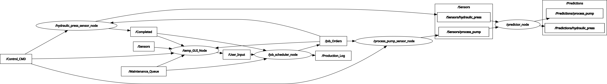

# Edge AI Remaining Useful Life (RUL) Prediction for Industrial Machines

## Project Overview

This project implements a modular ROS2-based Digital Twin for predictive maintenance in industrial environments. Synthetic sensor data from factory machines is used to predict Remaining Useful Life (RUL) and dynamically manage production flow on Edge AI hardware (e.g., Raspberry Pi).

### Key Concepts

- **Expert Models:** Each machine has a dedicated, physics-informed model for RUL prediction.
- **Predictor Node:** Central node for feature extraction and RUL inference using pre-trained XGBoost models.
- **Job Scheduler Node:** Orchestrates production jobs, manages dependencies, and tracks completion.
- **Controller Node (Planned):** Will handle maintenance actions and load balancing based on RUL predictions.
- **Target Metrics:** RUL prediction accuracy >80%, latency <50ms per node, >25% reduction in downtime.

---

## Machine List & Dataset Mapping

| Type      | Machine Name     | ROS Topic                | Dependency      | Dataset Link                                                                 |
|-----------|------------------|--------------------------|-----------------|-----------------------------------------------------------------------------|
| Main 1    | Hydraulic Press  | `/Sensors/hydraulic_press` | -               | [UCI Hydraulic Systems](https://archive.ics.uci.edu/ml/datasets/condition+monitoring+of+hydraulic+systems) |
| Helper 1  | Process Pump     | `/Sensors/process_pump`    | Feeds Press     | [Kaggle Water Pump RUL](https://www.kaggle.com/datasets/anseldsouza/water-pump-rul-predictive-maintenance) |

Other machines and datasets will be integrated in future releases.

---

## Architecture

### Node Structure & Implementation Status

- **machine_hydraulic_press_node**  
  Simulates synthetic sensor data for the hydraulic press. Implements realistic degradation and process physics.
- **machine_process_pump_node**  
  Simulates synthetic sensor data for the process pump, including load and degradation effects.
- **job_scheduler_node**  
  Receives job orders, splits them into tasks, manages dependencies, and publishes jobs to machine nodes.
- **predictor_node**  
  (Previously called central_predictor_dispatcher_node) Subscribes to machine sensor topics, extracts features, loads pre-trained models, and publishes RUL predictions.
- **controller_node** *(Planned)*  
  Will subscribe to prediction topics and issue control commands (`REDUCE_LOAD`, `PAUSE_JOB`, `REDISTRIBUTE_JOB`) via `control_cmd` and `maintenance_queue` topics.

#### ROS2 Node Graph

> The graph above shows the current ROS2 communication structure. Several nodes are in development; real sensor data and control logic are being integrated.

---

## Node Communication Flow

- **Job_Scheduler_Node**  
  Publishes job orders and listens for completion signals. Manages job dependencies and production status.
- **MachineX_Sensor_Node**  
  Receives job orders, simulates production cycles, and publishes synthetic sensor data.
- **Predictor_Node**  
  Listens to sensor data, extracts features, predicts RUL, and publishes results.
- **Controller_Node** *(Planned)*  
  Will listen to predictions and issue corrective/preventative actions:
    - `REDUCE_LOAD`: Slows down machine via `control_cmd`.
    - `PAUSE_JOB`: Temporarily halts production.
    - `REDISTRIBUTE_JOB`: Sends jobs to `maintenance_queue` for rescheduling.

Dashboard (Streamlit WebUI planned) will visualize job orders, alerts, maintenance queue, and machine status.

---

## Implementation Details

### Synthetic Sensor Data Generation

- Hydraulic Press:  
  See [`Machine_Hydraulic_Press_Node`](src/system_nodes/system_nodes/Machine_Hydraulic_Press_Node.py) for realistic signal generation, degradation modeling, and process physics.
- Process Pump:  
  See [`Machine_Process_Pump_Node`](src/system_nodes/system_nodes/Machine_Process_Pump_Node.py) for load-sensitive and degradation-aware sensor simulation.

### Job Scheduling

- Job orders are created via GUI or JSON ([`temp_GUI_Node`](src/system_nodes/system_nodes/temp_GUI_Node.py)).
- Scheduler splits jobs into tasks, assigns machines, and manages dependencies ([`Job_Scheduler_Node`](src/system_nodes/system_nodes/Job_Scheduler_Node.py)).
- Completed tasks trigger scheduling of dependent jobs.

### Prediction Pipeline

- Predictor node loads pre-trained XGBoost models and scalers ([`Predictor_Node`](src/system_nodes/system_nodes/Predictor_Node.py)).
- Features are extracted from recent sensor cycles.
- RUL predictions are published for each machine.

### Control Logic (Planned)

- Controller node will subscribe to prediction topics.
- Based on RUL and production status, it will publish control commands:
    - `REDUCE_LOAD` (to `/machineX/control_cmd`)
    - `PAUSE_JOB` (to `/machineX/control_cmd`)
    - `REDISTRIBUTE_JOB` (to `/factory/maintenance_queue`)
- These actions will be implemented in the next development phase.

---

## Current Progress

- Synthetic sensor data generation for hydraulic press and process pump is implemented.
- Job scheduling, dependency management, and completion tracking are functional.
- Predictor node is integrated and provides RUL predictions.
- Basic GUI node for job entry and monitoring is available.
- Models and diagnostics from pre-ROS2 phase are ready for deployment.

---

## Next Steps

- Implement controller_node and its actions (`REDUCE_LOAD`, `PAUSE_JOB`, `REDISTRIBUTE_JOB`).
- Integrate control logic for maintenance and load balancing.
- Expand dashboard for real-time monitoring and control.
- Add support for additional machines and datasets.

---

## Project Philosophy & Updates

This project is designed for modularity, scalability, and high-accuracy predictive maintenance in industrial digital twins. The README will be updated as new models, datasets, and architectural improvements are added.
