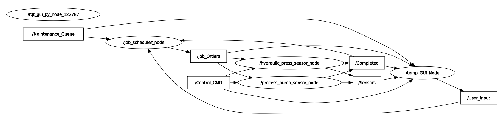

# Edge AI Remaining Useful Life (RUL) Prediction for Industrial Machines

## Project Overview
This project aims to build a ROS2-based Digital Twin for predictive maintenance in industrial environments. Using synthetic sensor data from six factory machines (three main, three auxiliary), the system predicts Remaining Useful Life (RUL) for each machine and dynamically manages production flow on Edge AI hardware (e.g., Raspberry Pi).

### Key Philosophy
- **Expert Models:** Six specialized models are trained, each tailored to the unique physics and failure modes of its respective machine.
- **Controller Node:** RUL predictions are used by a controller node to implement rule-based maintenance actions, with future plans to upgrade to a Reinforcement Learning (RL) agent for optimal maintenance and load balancing.
- **Target Metrics:** RUL prediction accuracy >80%, latency <50ms per node, and >25% reduction in downtime (RL vs rule-based).

## Machine List & Dataset Mapping
Only the following datasets are used in the current implementation:

| Type      | Machine Name     | ROS Topic        | Dependency      | Dataset Link                                                                 |
|-----------|------------------|------------------|-----------------|-----------------------------------------------------------------------------|
| Main 1    | Hydraulic Press  | /machine_press   | -               | https://archive.ics.uci.edu/ml/datasets/condition+monitoring+of+hydraulic+systems |
| Helper 1  | Process Pump     | /machine_pump    | Feeds Press     | https://www.kaggle.com/datasets/anseldsouza/water-pump-rul-predictive-maintenance |

Other machines and datasets are planned for future integration.

## Architecture

### Node Structure & Implementation Status

- **machine_hydraulic_press_node** and **machine_process_pump_node**:  
  Skeletons for these nodes have been established. They are intended to simulate sensor data streams for the hydraulic press and process pump, respectively. However, synthetic sensor data generation is not yet implemented.
- **job_scheduler_node**:  
  The initial structure is present, with TODOs outlining future scheduling logic and integration points.
- **temp_gui_node**:  
  A temporary, console-based GUI node is available for basic interaction and monitoring. This will be replaced by a Streamlit-based dashboard in future iterations.
- **central_predictor_dispatcher_node** (Planned):  
  This node will be responsible for distributing incoming sensor data to the appropriate expert models (pre-trained XGBoost regressors) and returning RUL predictions. Not yet implemented.

#### ROS2 Node Graph

> The node graph above illustrates the current ROS2 communication structure. Note that several nodes are in the setup phase and do not yet produce or consume real sensor data.

## Has Been: Pre-ROS2 Work

- **Hydraulic Press Model:** Trained using the UCI Hydraulic Systems dataset. Full pipeline includes feature extraction, stratified train-test splitting, scaling, XGBoost regression, and drift diagnostics. Model and scaler are saved for deployment.
- **Process Pump Model:** Trained using the Water Pump RUL dataset as a proxy for hydraulic pump RUL prediction. Similar pipeline and diagnostics applied.
- **Diagnostics:** Feature importance, drift analysis, and performance metrics are generated and saved for both models.
- **Project Migration:** As of November 2025, the project was moved from a Windows folder to a WSL environment under ~/capstone_project. Git history was preserved. Python virtual environment (venv/) was re-created, and dependencies are managed via requirements.txt.

## Current Progress (ROS2 & Beyond)
- ROS2 node skeletons for hydraulic press and process pump established.
- job_scheduler_node structure created, with future scheduling logic outlined.
- temp_gui_node implemented for basic monitoring; Streamlit migration planned.
- Initial ROS2 communication graph visualized via rqt_graph.
- Models and diagnostics from pre-ROS2 phase ready for integration.

## Next Steps
- Implement synthetic sensor data generation for all machine nodes.
- Develop and integrate central_predictor_dispatcher_node to route sensor data to expert models and return RUL predictions.
- Create a 2 way hand-shake between nodes for communication.
- Add controler_node and its functions for responding to the predictions from the dispatcher. 
- Test job sequence and complete MVP 

## Project Philosophy & Updates
This README will be updated as new models, datasets, and architectural improvements are added. The focus remains on modular, scalable, and high-accuracy predictive maintenance for industrial digital twins.